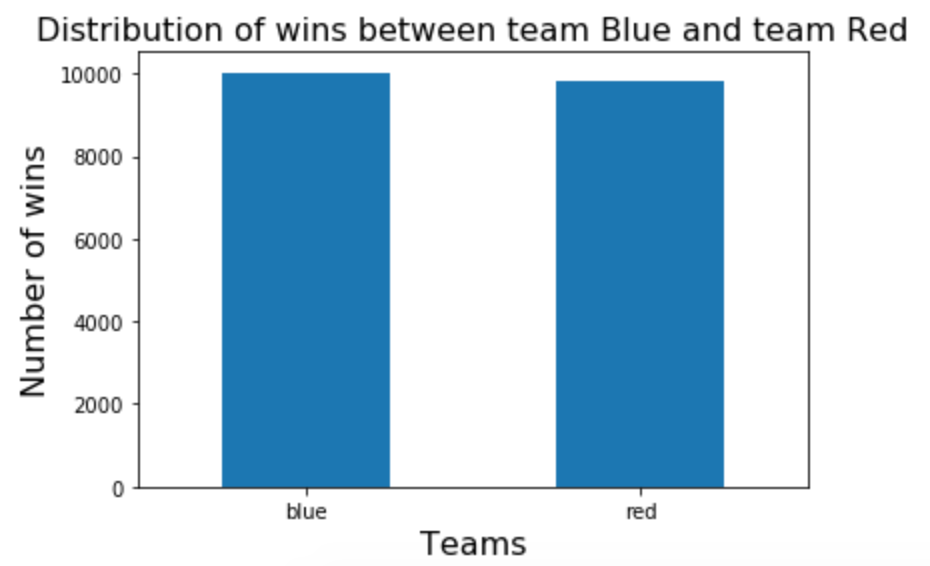
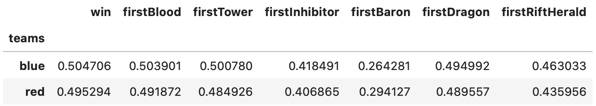
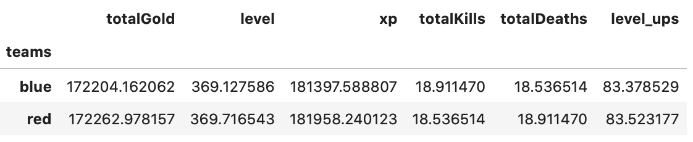
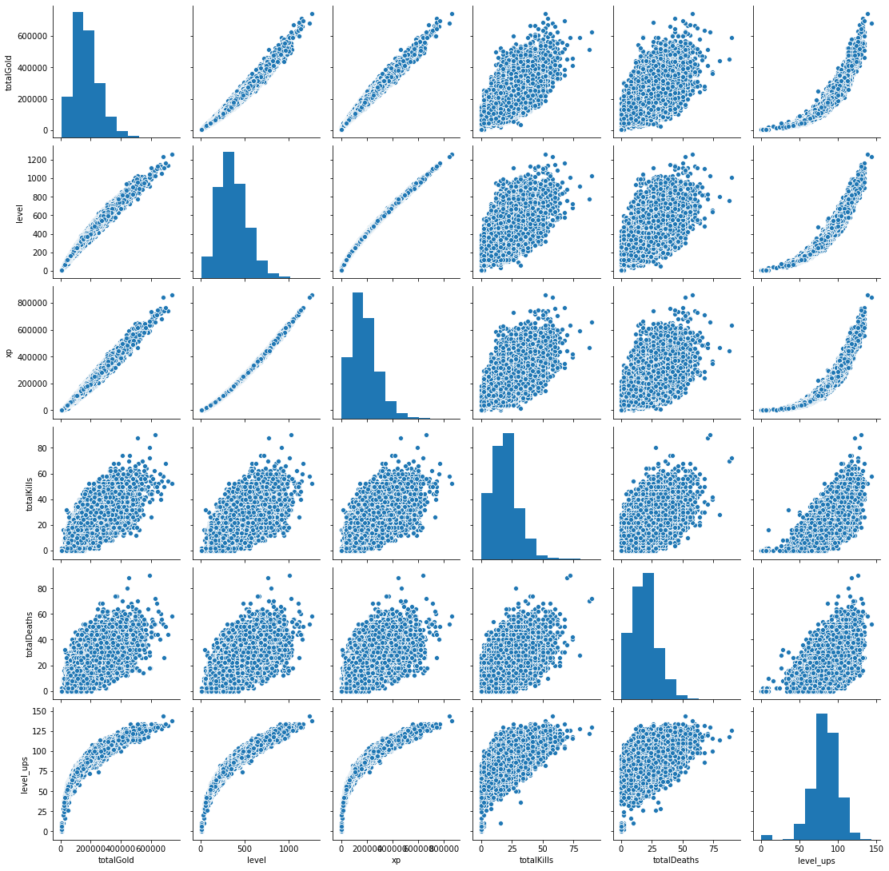
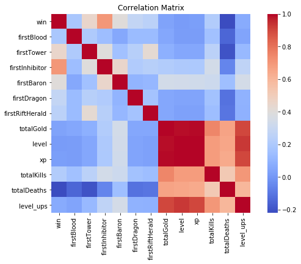
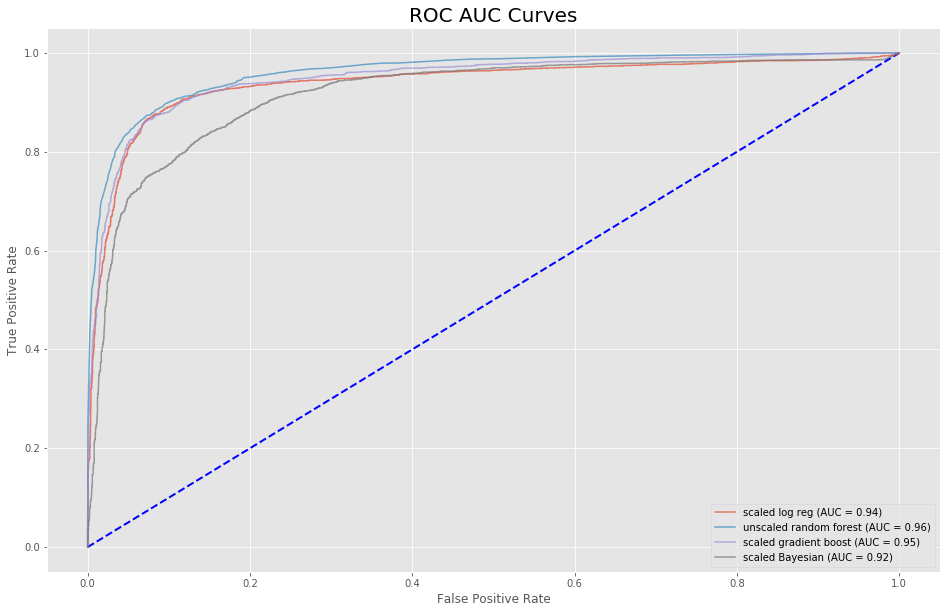
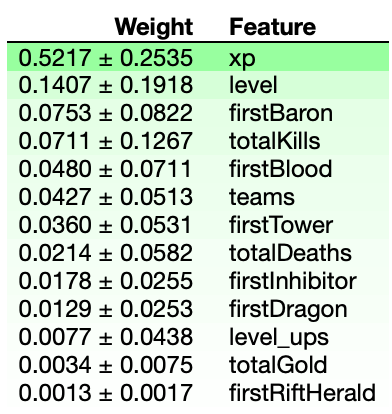
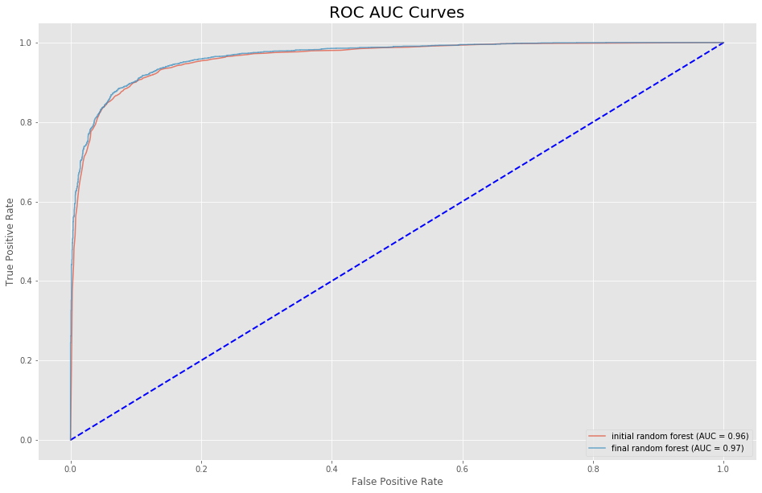

# MLoL
- [Background](#background)
- [Objective](#objective)
- [Data Collection](#data-collection)
- [EDA](#eda)
- [Data Analysis Pipeline](#data-analysis-pipeline)
- [Finding](#finding)
- [Future Plans](#future-plans)
- [Sources](#sources)

## Background

from [twitch.tv](https://www.twitch.tv/directory), May 13, 2020
 
The League of Legends (LoL) is one of the most popular Multiplayer Online Battle Arena (MOBA) games streamed on Twitch. It is continuously ranked top 5 in terms of viewership on Twitch.

## Objective
The analysis seeks to browse several team performance indicators in the first half of the match to predict the outcome with several machine learning algorithms. 

## Data Collection
The APIs that Riot Games (Riot) offers require IDs to extract any player or match information. For this project, I sourced the match IDs from the Canisback on the Discord ([link](http://canisback.com/matchId/matchlist_kr.json))

For this analysis, I pulled 10,000 match information from Riot's Korean region and another 10,000 from North American region using the following API URLs for 2 days:
> api.riotgames.com/lol/match/v4/matches/MATCH_ID?api_key=API_KEY

> api.riotgames.com/lol/match/v4/timelines/by-match/MATCH_ID?api_key=API_KEY

## EDA
Riot published LoL in 2009, and its continued popularity was due to Riot's constant patching to balance the game despite its age. As you can see below, the win rates between the blue team and the red team are well balanced.

Number of kills scored by blue and red teams

And the halftime statitics also correspond to the above finding.

Many of the features used for this analysis had a linear or an exponential relationship with each other with high correlation values, indicating multicollinearity. 

However, only three features in this analysis, teams that destroyed the match's first tower, first inhibitor, or first baron had an effect determining the match's outcome. Additionally, predicting an outcome with classification models is generally free from multicollinearity. Thus the features' multicollinearity was not addressed for the analysis.

Several features displaying multicollinearity

## Data Analysis Pipeline

For the analysis, I chose match information from the Korean server to train my model and test its precision against the data collected from the North American server. I chose logistic regression, random forest, gradient boosting, and naive Bayesian classification models with default parameters to perform an initial analysis.

To convert and manipulate data into an array of information for the machine learning models to understand, I first built a pipeline that would impute and scale numerical columns and impute and one hot encode categorical columns using the sklearn's Pipeline package. I then appended a classifier so that the process of fitting, transforming, and re-fitting the data would be automated.

Among the four models I used, the random forest performed the best and immediately took a look at the feature importances. Specifically, its AUC was the highest at 0.96 while other models closely followed at 0.95 for gradient boost, 0.94 for logistic regression and 0.92 for naive bayesian.

Default base models' performance

Although the inner workings of the random forest model is a black box and we cannot accurately gauge individual feature's weights or coefficients, it does give us an insight in terms of feature importances. If you refer to the figure below, it is surprising that many of the features that did not have a strong correlation to the match outcome are considered important by the random forest model.

Feature importances from random forest

The base models performed surprisingly well, and I did not expect much improvement from tuning hyperparameters. For tuning the random forest classifier, I tuned the following parameters: 
* Number of estimators
* Max depth of each model
* Max number of features

The Gridsearch CV found 6 features, 200 estimators and a depth of 8 nodes to be the best out of the provided parameter ranges with a precision score of 0.91, an improvement of 0.01, and I proceed to use the tuned model against the test dataset.

Comparing base and tuned models

## Finding

Against the test dataset, the tuned model performed just as well with a precision score of 0.9. 

The results from the above models indicate that match outcomes are determined as early as the first half of their duration.

Additionally, the model's performance with tuned hyperparameters demonstrates that there are no regional variances at least between matches played in Korea and North America.

## Future Plans
* Perform a time series analysis and predict the likelihood of the outcome much sooner than the first half of the match.
* Collect chat data from Twitch and corresponding streamers' LoL performance to perform NLP analysis coupled with Riot API's event timelines.
* Perform a hypothesis testing to examine whether the widespread belief that the blue team has a higher chance of winning than the red team is statistically sound.

## Sources
* https://developer.riotgames.com/apis
* http://canisback.com/matchId
* Twitch.tv
