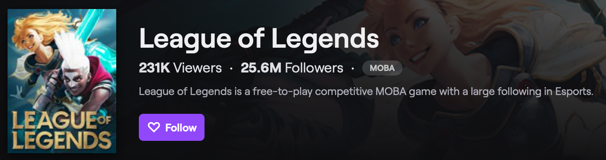

# MLoL
- [Background](#background)
- [Objective](#objective)
- [Data Collection](#data-collection)
- [EDA](#eda)
- [Analysis](#analysis)
- [Results](#results)
- [Sources](#sources)

## Background

from [twitch.tv](https://www.twitch.tv/directory) as of May 13, 2020
 
The League of Legends is one of the most popular Multiplayer Online Battle Arena (MOBA) games streamed on Twitch. 

## Objective
The analysis seeks to browse a number of team performance indicators in the first half of the match to predict the outcome with a number of machine learning algorithms. 

## Data Collection
The APIs Riot Games (Riot) offers require IDs for us to extract any player or match information. For this project, I sourced the match IDs from the Canisback on the Discord ([link](http://canisback.com/matchId/matchlist_kr.json))

Afer pulling a list of 10,000 match IDs, I pulled their match information using the following APIs provided by Riot:
> api.riotgames.com/lol/match/v4/matches/MATCH_ID?api_key=API_KEY

> api.riotgames.com/lol/match/v4/timelines/by-match/MATCH_ID?api_key=API_KEY

To simplify the data collection process, I built a function for each API query and had it store the data in a csv file separately.

The 2 csv files were joined via pd.merge() for this analysis.

## EDA
Due to a number of API errors, I had to restart the API queries multiple times. As a result, there were duplicates and missing values between the two dataframes
## Analysis
test
## Results
test
## Sources
* https://developer.riotgames.com/apis
* http://canisback.com/matchId/matchlist_kr.json
* Twitch.tv
