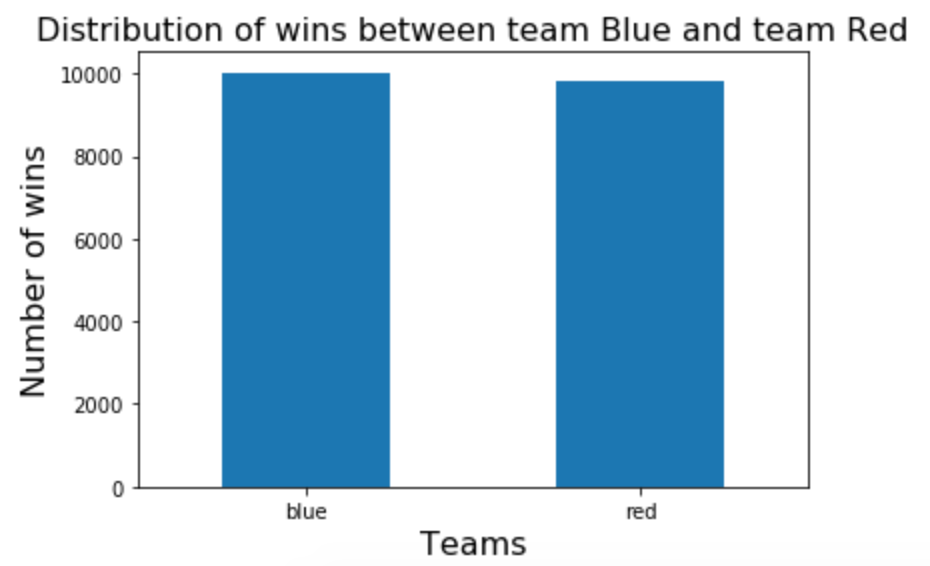

# MLoL
- [Background](#background)
- [Objective](#objective)
- [Data Collection](#data-collection)
- [EDA](#eda)
- [Analysis](#analysis)
- [Results](#results)
- [Future Plans](#future-plans)
- [Sources](#sources)

## Background

from [twitch.tv](https://www.twitch.tv/directory) as of May 13, 2020
 
The League of Legends (LoL) is one of the most popular Multiplayer Online Battle Arena (MOBA) games streamed on Twitch. It is constantly ranked in top 5 in terms of viewership on Twitch.

## Objective
The analysis seeks to browse a number of team performance indicators in the first half of the match to predict the outcome with a number of machine learning algorithms. 

## Data Collection
The APIs Riot Games (Riot) offers require IDs for us to extract any player or match information. For this project, I sourced the match IDs from the Canisback on the Discord ([link](http://canisback.com/matchId/matchlist_kr.json))

Afer pulling a list of 10,000 match IDs, I pulled their match information using the following APIs provided by Riot:
> api.riotgames.com/lol/match/v4/matches/MATCH_ID?api_key=API_KEY

> api.riotgames.com/lol/match/v4/timelines/by-match/MATCH_ID?api_key=API_KEY

To simplify the data collection process, I built a function for each API query and had it store the data in a csv file separately.
## EDA
Riot published LoL in 2009 and it's popularity, inspite of its age, is due to Riot's contstant patching to balance the game. As you can see below, the win rate 

## Analysis

The performances of the default base models

## Results
The base models performed surprisingly well and I did not expect much improvement from tuning hyperparameters as a result. As expected, tuning hyperparameters did not yield any meaningful gains. The take away I 

## Future Plans
* Perform a time series analysis and predict the likelihood of the outcome much sooner than the first half of the match.
* Collect chat data from Twitch and corresponding streamers' LoL performance to perform NLP analysis.
* Perform a hypothesis testing to examine whether the popular belief of blue team having a higher chance of winning is statistically sound.

## Sources
* https://developer.riotgames.com/apis
* http://canisback.com/matchId/matchlist_kr.json
* Twitch.tv
